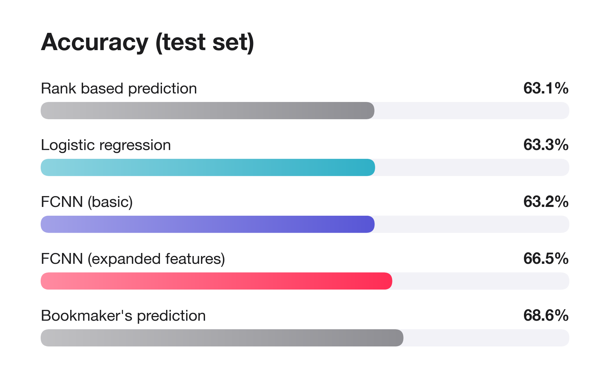
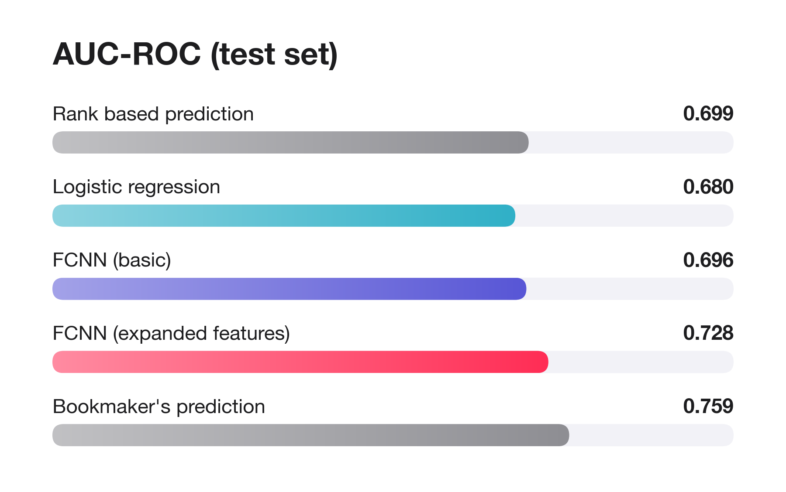

# WTA Match Winner Prediction

This project investigates some fundamental modeling techniques for predicting the winner of women's professional tennis matches (WTA) using historical performance.

## Task and interpretation

The work was scoped as **binary classification task** where the model predicts a winner, rather than predicting the score or individual sets due to time constraints.

The classes are:

- **Class 1:** Player 1 wins.
- **Class 0:** Player 2 wins.

Each model estimates a win probability and selects the more likely winner. The models make use of various columns in the dataset as input features and train/validation/test splits are formed keeping in mind that the data are a sparse time series.

## Notebooks

The four notebooks in [`src/`](src/) separate data preparation from 3 different model development methodologies, with each building upon the foundations established by the previous approach.

| Notebook | Purpose | Inputs |
|---|---|---|
| [`preprocessing.ipynb`](src/preprocessing.ipynb) | Inspect and clean the raw data; derive bookmaker probabilities and recent win rates; write the cleaned dataset. | `data/wta.csv` |
| [`logistic_regression.ipynb`](src/logistic_regression.ipynb) | Establish a simple learned baseline using L2-regularized logistic regression (`C=1.0`). | Court, surface and both player ranks. |
| [`notebook-v1-fcnn.ipynb`](src/notebook-v1-fcnn.ipynb) | Test a fully connected neural network with two hidden layers on the same basic features. | Court, surface and both player ranks. |
| [`notebook-v2-fcnn.ipynb`](src/notebook-v2-fcnn.ipynb) | Extend the neural network with summaries of each player's recent performance. | Basic features plus historical probabilities, results relative to expectations, scores and ranks. |

The progression asks whether model complexity helps with basic inputs, then whether additional historical information improves predictions.

## Data preparation and features

The notebook preprocessing.ipynb reads explicit numeric types and recognizes missing or malformed values, including `-` and `5..5`. It removes records with negative decimal odds, excludes missing dates, sorts matches chronologically, and trims leading and trailing whitespace from player names while preserving internal spacing.

It also computes bookmaker **overround / margins** and normalized implied probabilities:

```text
Margin = 1 / Odd_1 + 1 / Odd_2 - 1
Prob_1 = (1 / Odd_1) / (1 / Odd_1 + 1 / Odd_2)
Prob_2 = 1 - Prob_1
```

Records with negative overround are excluded by the current cleaning pipeline. 

An initial hypothesis was that bookmaker margin might carry information about the bookmaker's own confidence in its player win odds, so I was particularly interested in investigating any changes in model perfomance with this feature. However, the feature later did not prove to make meaningful improvement to the metrics discussed below.

The preprocessing notebook also creates win rates over the preceding 180 days and the last five matches within 365 days. 

After various experiments, the following features were found to be the most helpful for model performance and were thus finalized for inclusion in `notebook-v2-fcnn.ipynb`:

- Historical bookmaker win probability and the actual result minus that probability.
- Proportion of games and sets won, where the score can be interpreted reliably.
- Log-transformed player and opponent ranks.

## Evaluation approach

Matches are split by date at boundaries near **80% training, 10% validation and 10% test**, keeping a date within one split. This avoids training on future matches to predict earlier ones. The saved evaluations contain **4,464 test matches**.

Two simple baselines provide context:

1. **Rank baseline:** choose the player with the lower numerical rank.
2. **Bookmaker baseline:** choose the player with the higher normalized pre-match probability.

The neural networks use ReLU activations, Adam optimization and cross-entropy loss, restoring the epoch with the lowest validation loss. 

Both FCNN notebooks include an optional 18-combination grid search over learning rate and hidden-layer widths; those search cells are currently commented out, as the grid search can take ~20 minutes or longer to run on my Macbook Air M1.

## Main results

Results below come from [`output/summary.csv`](output/summary.csv). Experimental run results are not reported for the sake of brevity.

| Model / baseline | Test accuracy | Precision | Recall | F1 | ROC AUC |
|---|---:|---:|---:|---:|---:|
| Rank baseline | 63.13% | 0.6317 | 0.6295 | 0.6306 | 0.6992 |
| Logistic regression | 63.26% | 0.6313 | 0.6375 | 0.6344 | 0.6796 |
| FCNN (basic features) | 63.17% | 0.6316 | 0.6322 | 0.6319 | 0.6958 |
| **FCNN (expanded features)** | **66.51%** | **0.6671** | **0.6591** | **0.6631** | **0.7281** |
| Bookmaker baseline | 68.62% | 0.6823 | 0.6967 | 0.6894 | 0.7587 |

The expanded FCNN is the strongest trained model in these results. It improves accuracy by **3.38 percentage points** over rank and **3.34 points** over the basic FCNN, but remains **2.11 points below** the bookmaker baseline. On these runs, adding historical information helped more than switching from logistic regression to a neural network with the same basic features. This indicates that models that can capture sequential patterns such as RNNs, LSTMs or Transformers may be well suited to the task - however, the research literature in this domain was found to be limited and often achieved performance metrics similar to the ones quoted in this project! 

Though the expanded model uses **historical bookmaker information**; it does not receive current-match bookmaker probabilities. The experiments do not establish that the model improves on the bookmaker's assessment, however they do improve on a purely rank-based selection approach.

### Test accuracy



### ROC AUC



## Running the project

Install the dependencies in your Python environment:

```bash
python -m pip install -r requirements.txt
```

Open the notebooks in a Jupyter-compatible editor and run them with `src/` as the working directory, since data paths are relative to that folder.

1. Run `preprocessing.ipynb` to create `data/clean_wta.csv`.
2. Run the three model notebooks from top to bottom. They read the cleaned data independently.
3. Inspect the evaluations and exported metrics in `output/summary.csv`.

The neural-network notebooks select CUDA or Apple MPS when available, otherwise CPU. They also contain export cells for model weights and fitted preprocessing. 

## If given more time, how would I improve the model?

1. **Strengthen dataset split creation strategies.** The learning curves produced by the FCNNs depict a gap in the loss achieved between the train and validation sets. This is likely because, owing to time constraints, I simply sorted the data in chronological order to make a logically valid test/train/validation split. Using walk-forward validation across several periods, compare recent-only training with the full history, and investigate whether older seasons dominate learning may help mitigate this oddity.
2. **Elo ratings as a feature.** Computing pre-match Elo ratings have been useful in game outcome predictions in this domain and may prove to be a useful input feature for the model to have.
3. **Investigate sequence models.** Compare RNNs, LSTMs and transformers with the averaged-history FCNN on matched features and splits. They may retain useful ordering information. I had not used these architectures in such a context yet - using them only for next token prediction type tasks. Though some attempt was made in this direction, I realized that the input features in this context would require some careful thought and consideration - sparse and irregular player histories would require careful handling.
